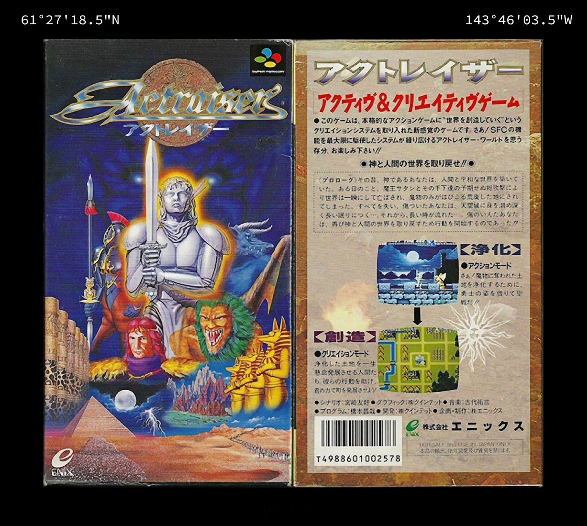

# D.G1: alaska

Upon completing [K.3C](../keys.md#3c-oohhyayamp), one is shown an image of the Japanese box art for Actraiser, a 1990 SNES/Super Famicom platformer and city-building game.
It has been confirmed that the cover has not been modified or distorted in any way.

The image also includes the GPS coordinates 61° 27' 18.5" N 143° 46' 3.5" W, which point to 27 McCarthy Rd, a few kilometers out from Chitina, Alaska.
Google Street View reveals that this is the location of a "Halfway House" B&B.

This all correlates with the image's filename, `actraiser_chitinaalaska`.
By adjusting the levels of the image, the word "patience" appears at the bottom below the Actraiser cover.
