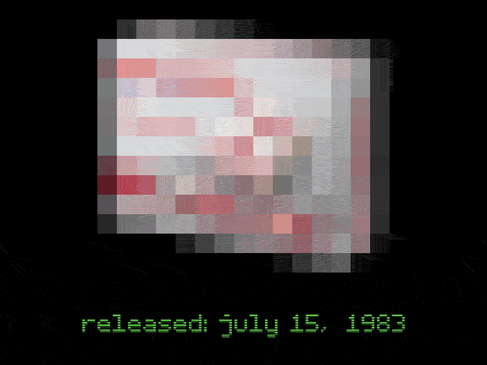
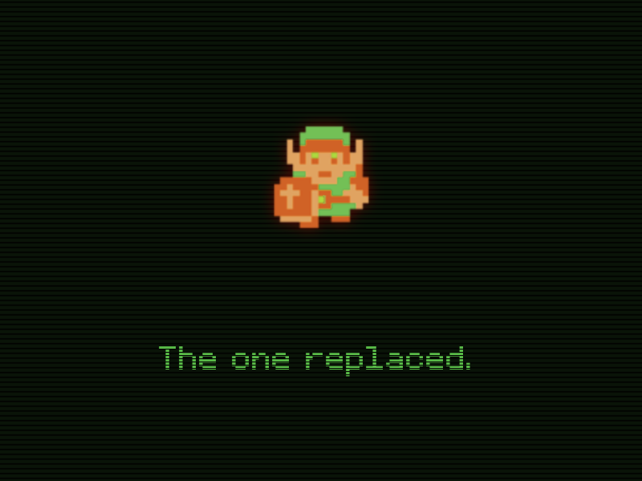
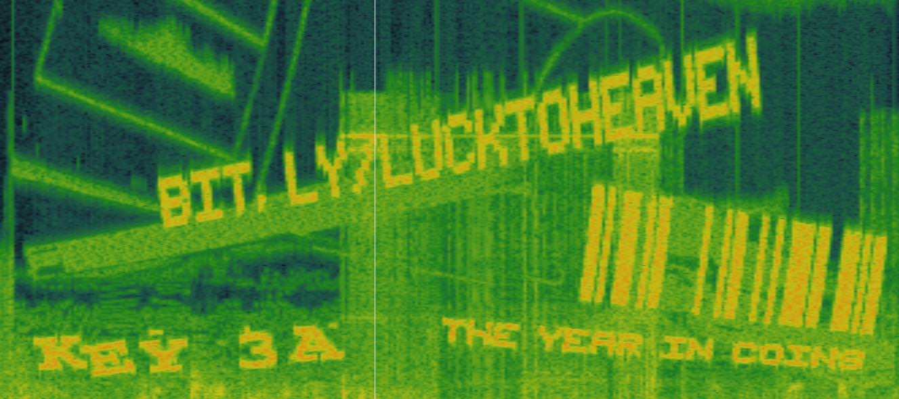
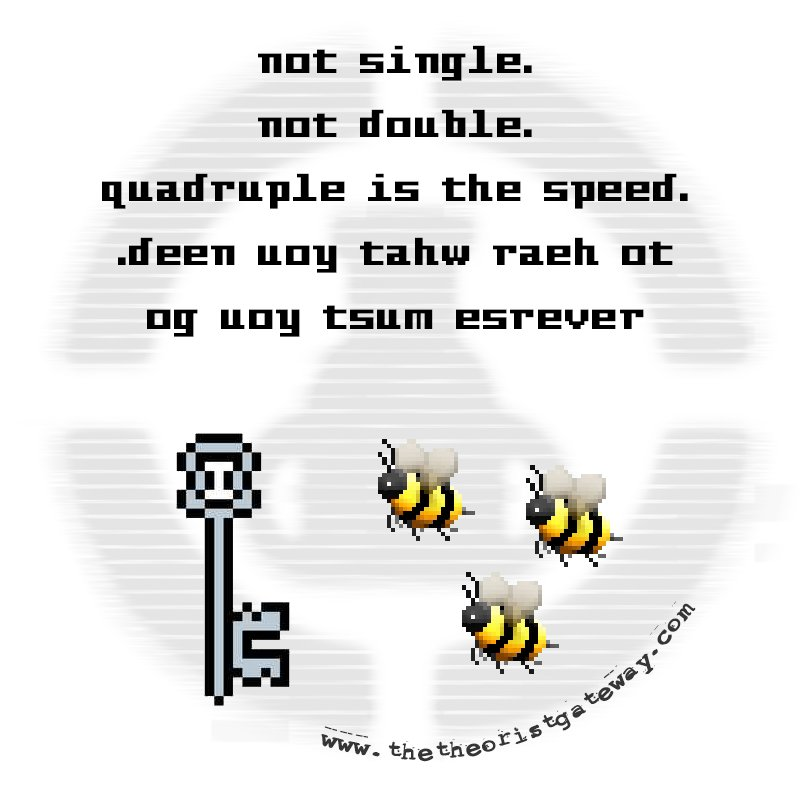
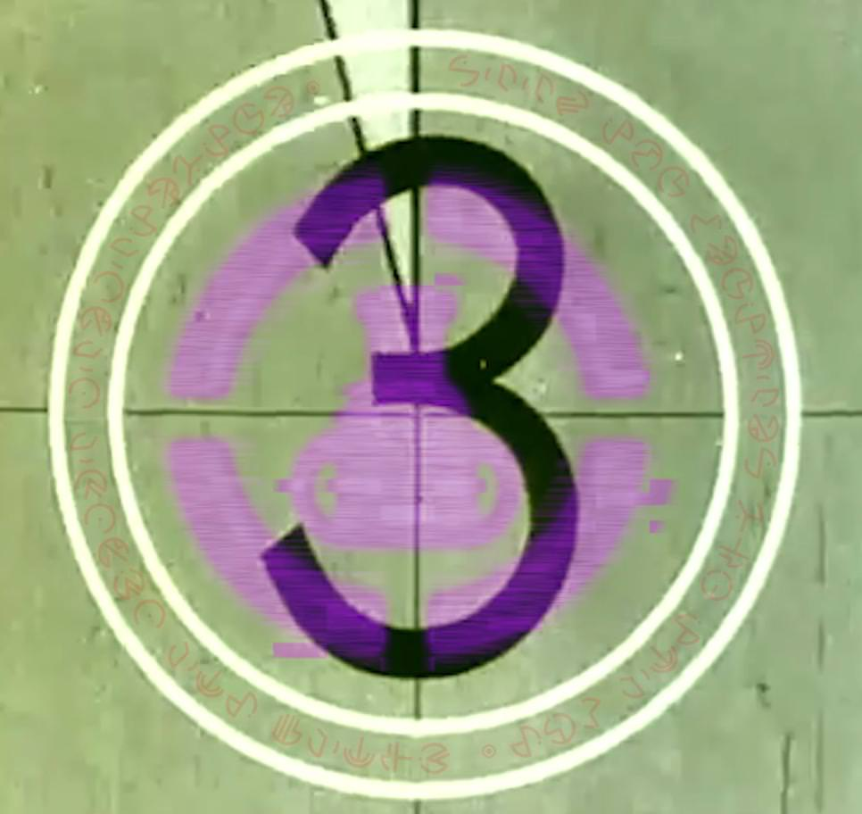
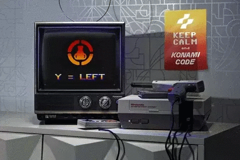

# Keys

On 11/24 at 15:07, the gateway opened.
It was then finally clear what a "key" and a "gate" were.

## 1: FAMICOM

A blurred picture of a Famicom was provided, subsequently easily and quickly identified.
The concept of "Famicom" as a clue first appeared in [pre:D.E1](../pre-arg/d.e1.md) alongside the Japanese release date of 07/15/1983.
Therefore, the key was Famicom.

## 2: KOOPA TROOPA

The second key was a sprite of Link from the NES Legend of Zelda game with the text "the one replaced".
This hearkened back to [pre:D.Y3](../pre-arg/d.y3.md), where the text "the one replaced" was found.
This clue specifically refers to how the provided Link sprite replaced a Koopa Troopa in the Game Theory intro in pre:D.Y3.
Therefore, the key was Koopa Troopa.

## 3: R.O.B.

The third key was split into three sections, whose clues were all located within the same video clip.
The clip consisted of a video of an R.O.B. controller/robot for the Famicom.

### 3A: YOSHI'S SAFARI

The first section, notated 3A both on the site and on this document, was marked within a spectrogram of the video.
It revealed a barcode and the text "bit.ly/lucktoheaven" and "the year in coins".
Referring to [pre:D.E2](../pre-arg//d.e2.md), there are 93¢ in coins, indicating the year 1993.
Combining it with the barcode hex which was decoded to "yoshi", the connection to the 1993 Famicom game Yoshi's Safari becomes trivial.
QED.

### 3B: OVERWORLD

The spectrogram also revealed another clue notated 3B.
The 3B spectrogram was accompanied by a Twitter logo, and an image was tweeted out by MatPat at the same time the gate opened.
The image contained a rebus for "key three bee" \(Key 3B\) and indicated the audio must be played at ¼ speed and in reverse.
The resulting audio was recognized as the "Overworld" theme from The Legend of Zelda.

### 3C: OOHHYAYAMP!

The final key from the R.O.B.
video could be found on one of the countdown frames.
The frame contained the upside-down Game Theory logo signifying an ARG clue existed along with "alien" letters from [pre:D.Y3](../pre-arg/d.y3.md).
The letters decoded to "Seek two brothers and the bot / Unhex the purple perpetrator".
On another frame where two brothers are playing a game with R.O.B., the text `http://www.imgur.com/4469384a784d67` is visible.
"Unhexing" \(ASCII hex decoding\) the highlighted purple text gives "<http://www.imgur.com/Di8JxMg>", an image clearly indicating Key 3C.

Within this image, two sets of glyphs can be found.
By changing brightness, "the cipher is hidden".
By changing contrast, "change the hue to see the clue".
After changing the hue, another hex code appears, pointing to [this GIF](https://media.giphy.com/media/1ZwSCnlT8HinW4vif9/giphy.gif).
The "Keep Calm and Carry On" themed poster in the background hints at the Konami code, a famous cheat code from old Konami games \(↑ ↑ ↓ ↓ ← → ← → B A Start\).
By translating the keystrokes to characters using the code on the Duck Hunt-themed screen, the resulting key is "OOHHYAYAMP!".

