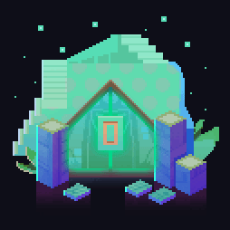

# D.G2: Gateway Artwork

On 12/05, the gateway started a 48 hour countdown. While seeing the countdown, theorists found that there was more to this release than just a countdown

People found that the background of the gate looked like the Doki Doki Literature Club *(Team Salvado)* pink dots that are shown at the start menu and in the text boxes throughout the game.
People also saw that the gateway resembled Torial from UNDERTALE *(Toby Fox)*.

Everything came together with all of the hints hidden in the gateway to show that this gateway will be about INDIE games. INDIE games are games that usually dot not have the financial support from publishers.

Apart from the game resemblence, theorists found that the morse code from all of the blinking parts stated "THEONETRUEGOD". There was argument on if that mean in real life, or a game.
